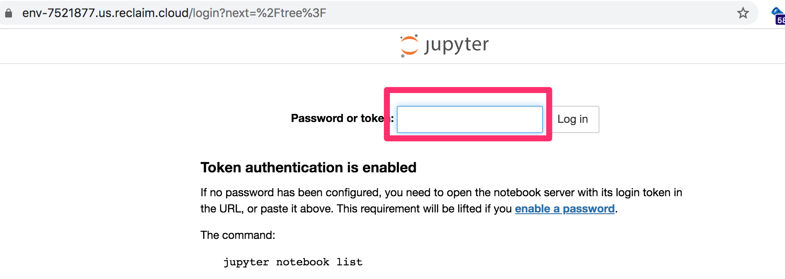

# minimalJupyterNotebook
Minimal personal Jupyter notebook launcher

This repo file contains a simple manifest file that defines a configuration capable of launching a minimal Jupyter notebook server on [Reclaim Cloud](https://reclaim.cloud/).

Clicking the button will automatically load the manifest file from this repo in your [Reclaim Cloud console](https://app.my.reclaim.cloud) if you are already logged in.

If you want to load the file manually, copy the raw file URL from the Github repo:

And then add paste it into the new environment *Import* from *URL* dialogue:

When you hit the *Import* button, the environment will be created:

*This may take some time...*

When it's ready:

you can click on the automatically generate URL to go to your enviroment:

If you forget to take note of the environment, launch the environment console, and echo the token value (`echo $JUPYTER_TOKEN`):

If you want to review all the environment variables, run the command: `printenv`

